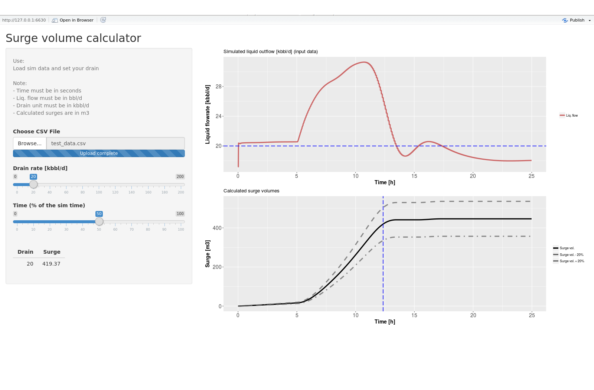

# Surge Calculator

This web app calculates the surge volume associated to a specific operation (i.e. in a speciific time frame).

In case of transient events, in fact, it can happen that for a multiphase pipeline the liquid outflow is greater that the drain capacity of the receiving vessel at the pipeline outlet. When this happens the receiving vessel needs to store the liquids in excess (<i>surge</i>) until the drain is able to reduce the liquid level inside the vessel itself.
If the surge volume is too big respect the vessel size there is the risk to flood the vessel with potentially high consequences on the operations.

## How to

The app is pretty straightforward: 
1. load the simualted data
2. adjust the drain rate to the required value
3. play with the time to get the desired surge in the table on the left

...but not very flexible:
1. the time must be in seconds
2. the liq. flowrate must be in bbl/d
3. the drain rate must be constant and expressed in kbbl/d
4. The source data must be a 2 cols dataframe with the first row as header

## Screenshot

