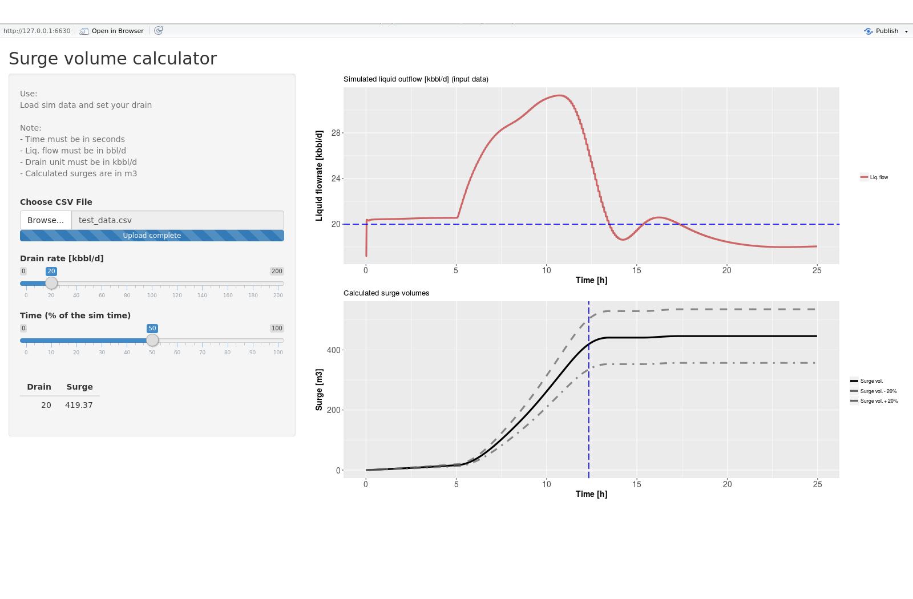

How to calculate a surge volume
========================================================
author: Giuseppe Pagliuca
date: 6 Feb 2018
autosize: true

What is a surge volume?
========================================================


For a multiphase pipeline it can happen that in some specific transient conditions the liquid outflow is greater that the drain capacity of the receiving vessel at the pipeline outlet. When this happens the receiving vessel needs to store the liquids in excess (<i>surge</i>) until the drain is able to reduce the liquid level inside the vessel itself.

If the surge volume is too big respect the vessel size there is the risk to flood the vessel with potentially high consequences on the operations.

How to calculate the surge volume (1/3)
========================================================


The surge volume can be calculated knowing the evolution in time of the liquid outflow from a pipeline and the vessel drain rate.

$surge = \sum{(liq.\ production - drain\ rate) * time\ interval}$


How to calculate the surge volume (2/3)
========================================================

The surge volume associate to a specific operation can be calculated integrating the simulated liquid production over discrete time intervals:


```r
surge_calc <- function(time, liq, drain) {
            dt <- diff(time)
            mav <- function(x,n=2) {stats::filter(x,rep(1/n,n), sides=2)}
            acc <- (mav(liq) - drain)
            acc[acc<0] <- 0
            cum_acc <- cumsum(acc) * (dt[1]/(24*3600))
            return(cum_acc*0.1589873)
}

df <- read.csv('data/test_data.csv')
surge <- surge_calc(df[, 1], df[, 2], 20*1000)
tail(surge[!is.na(surge)], n=1)
```

```
[1] 446.2437
```

This is the surge volume (in m3) for the test data.

How to calculate the surge volume (3/3)
========================================================

The <i>surge calculator</i> app does the same thing but it provides an interactive way to play with the available drain rate:


